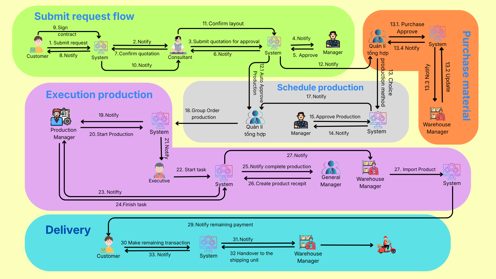

# AMMS - Make-to-Order (MTO) Manufacturing Execution System for Packaging

<div align="center">
  <h3>A Custom B2C Manufacturing Execution System for Dai Phuc Hai Packaging</h3>
  <p><strong>🌐 Live Demo: <a href="https://daiphuchai.vercel.app" target="_blank">daiphuchai.vercel.app</a></strong></p>
</div>

## 📌 Project Overview

**AMMS (Advanced Manufacturing Management System)** is an in-house, specialized **Make-to-Order (MTO)** manufacturing execution system built exclusively for **Dai Phuc Hai Printing and Packaging Trading Service Co., Ltd**. This custom B2C solution is designed to digitize and optimize their entire end-to-end production pipeline. It seamlessly handles customer order intake, automated cost estimation, intelligent production scheduling, and real-time execution tracking at the factory floor level.

## 🌟 Core Workflows & Features

This project focuses on solving complex enterprise manufacturing challenges rather than basic CRUD operations:

### 1. Automated Price Calculation & Quote Estimation
- **Automated Costing:** Upon receiving a customer's design, the system automatically calculates the price based on the specific design parameters and the chosen type of product.
- **Inventory Check & Material Estimation:** The system automatically checks existing inventory for ready-made products. If insufficient, it automatically breaks down the design to estimate the required raw materials and suggests procurement actions to the Planning Department.

### 2. Multi-Level Order Approval
- If raw materials are insufficient or production conditions are sub-optimal, the system flags the order to the Planning Department for consultation.
- The General Manager then reviews the order based on system-aggregated data and planning advice before granting final **Order Approval**.

### 3. Intelligent Production Scheduling (Batching)
- **Automated Batching:** Once materials are ready, the system intelligently groups pending orders with similar manufacturing processes or stages into "Batches".
- **Resource Optimization:** Scheduling can be configured with waiting periods to optimize machine setups, raw material usage, and labor, significantly reducing setup time overhead.
- Approved schedules are automatically broken down into specific tasks and assigned to the Production Manager and shift leaders.

### 4. Production Execution & Stage-by-Stage Reporting
- The Production Manager triggers the manufacturing process once the pipeline is ready.
- **Mobile App & QR Code Integration:** Shift leaders (Foremen) use a dedicated **Mobile App** on the factory floor to receive tasks, report daily completion metrics, and log real-time progress.
- The Production Manager verifies and accepts each completed stage by scanning a **QR Code**, strictly controlling the transition to the next manufacturing stage.
- **Excess Product Handling:** Any surplus products manufactured during the run can be logged and redirected to inventory as finished goods based on the Planning Department's decision.

### 5. Automated Notifications & Real-Time Sync (Websocket, Resend, Twilio)
- **Real-time Notifications:** Utilizes **WebSocket (SignalR)** to push live updates regarding order statuses, machine states, and cross-departmental alerts instantly.
- **Email Delivery:** Integrated with **Resend** (3rd party service) for reliable transactional emails (e.g., order confirmations, approval requests).
- **SMS OTP Verification:** Powered by **Twilio** for secure user authentication and critical customer SMS alerts.
- **Background Jobs:** Automated background workers evaluate order states, predict potential delays, and trigger risk alerts without manual intervention.

## 💻 Tech Stack

### Back-end
- **Framework:** .NET 8, ASP.NET Core Web API
- **Database:** PostgreSQL with Entity Framework Core (Code-first approach)
- **Architecture:** Clean Architecture, Dependency Injection
- **Integrations:** SignalR (WebSockets), Resend (Emails), Twilio (SMS OTP), Cloudinary

### Front-end / Mobile App
- **Web Portals:** Specialized interfaces tailored for different roles: Consultants, Planners, Production Managers, Warehouse Keepers, and Customers.
- **Mobile App:** Built for shift leaders on the factory floor for high-mobility tasks, QR code scanning, and fast data entry.

## 🔑 Demo Accounts & Workflow

### 📱 Mobile App Demo
**Link APK Mobile Demo:** [Download APK](https://drive.google.com/file/d/1PmFxWP1O4I2V0M8fo4nqTqgOnuhA1JmN/view?usp=sharing)

| Role | Username | Password |
| :--- | :--- | :--- |
| Staff Ralo | staff ralo | 1 |
| Staff Cat | staff cat | 1 |
| Staff In | staff in | 1 |
| Staff Phu | staff phu | 1 |
| Staff Can | staff can | 1 |
| Staff Boi | staff boi | 1 |
| Staff Be | staff be | 1 |
| Staff Dut | staff dut | 1 |
| Staff Dan | staff dan | 1 |

### 🌐 Website Demo
*The process flow is illustrated in the image below:*

 <!-- Bạn hãy đổi tên file hoặc đường dẫn ảnh cho phù hợp nếu cần -->

| Role | Username | Password |
| :--- | :--- | :--- |
| Admin | admin | 1 |
| Production Manager | production manager | 1 |
| General Manager | general manager | 1 |
| Consultant | consultant | 1 |
| Warehouse Manager | production manager | 1 |
| Manager | manager | 1 |
| Customer | mtrg234 | 1 |

## ⚙️ Local Development Setup

1. System Requirements:
   - .NET 8 SDK
   - PostgreSQL
   - Docker (Optional)
2. Clone the repository:
   ```bash
   git clone https://github.com/truongpm234/MMES_SEP490.git
   ```
3. Update the Connection String and API Keys (Resend, Twilio, etc.) in `appsettings.json` located in `AMMS.API`.
4. Run Migrations to initialize the database:
   ```bash
   dotnet ef database update -p AMMS.Infrastructure -s AMMS.API
   ```
5. Start the application:
   ```bash
   dotnet run --project AMMS.API
   ```

---
*This project highlights the ability to analyze and design a complex enterprise system, apply scalable software architecture, and solve real-world manufacturing business logic for a specific B2C enterprise.*
